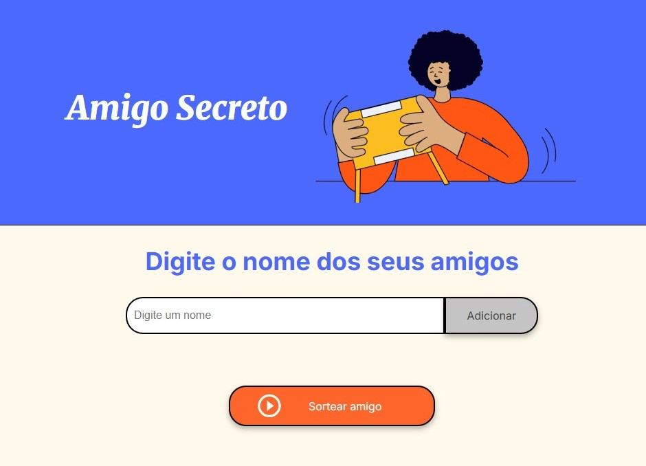

# challenge amigo secreto




> Sorteador de nomes com objetivo de criar uma dinâmica de amigo secreto.

## 💻 Pré-requisitos

Antes de começar, verifique se você atendeu aos seguintes requisitos:

- Você instalou a versão mais recente de `<linguagem / dependência / requeridos>`
- Você tem uma máquina `<Windows / Linux / Mac>`. Indique qual sistema operacional é compatível / não compatível.
- Você leu `<guia / link / documentação_relacionada_ao_projeto>`.

## ☕ Usando <challenge amigo secreto>

Para usar <challenge amigo secreto>, siga estas etapas:

```
git clone https://github.com/kikito-k/challenge-amigo-secreto.git
```

## 📝 Licença e agradecimento

Esse projeto é aberto. Veja o arquivo. Agradeço a ALURA pela oportunidade.
